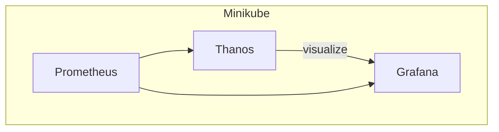

# Prometheus, Thanos, and Grafana Relationships

This document illustrates the relationships between Prometheus, Thanos, Grafana, and Minikube using Mermaid diagrams.

## Usage
To visualize the relationships, you need to have Mermaid installed and configured in your environment. You can use the following Mermaid code to generate the diagram.

All components (Prometheus, Thanos, and Grafana) are deployed within a Minikube cluster.

- **Prometheus**: A monitoring system and time series database.
- **Thanos**: A highly available Prometheus setup with long-term storage capabilities.
- **Grafana**: A visualization tool for monitoring and analytics.
- **Minikube**: A tool that runs a single-node Kubernetes cluster locally.

### Relationships

- Prometheus collects and stores metrics data.
- Thanos extends Prometheus by providing long-term storage and high availability.
- Grafana visualizes data from both Prometheus and Thanos.
- Minikube provides a local Kubernetes environment to deploy and test Prometheus, Thanos, and Grafana.

### Ports

- **Prometheus**: Typically runs on port `9090`.
- **Thanos**: Various components run on different ports, commonly `10901` for the Store API.
- **Grafana**: Typically runs on port `3000`.
- **Minikube**: Provides access to the Kubernetes dashboard on port `30000`.

Ensure you have the necessary plugins or configurations to render Mermaid diagrams in your markdown viewer.
